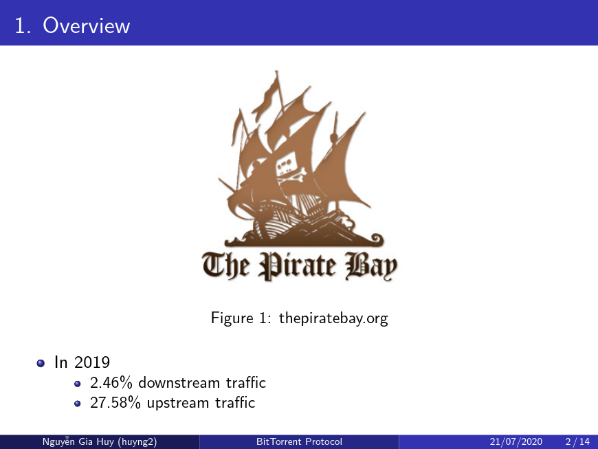
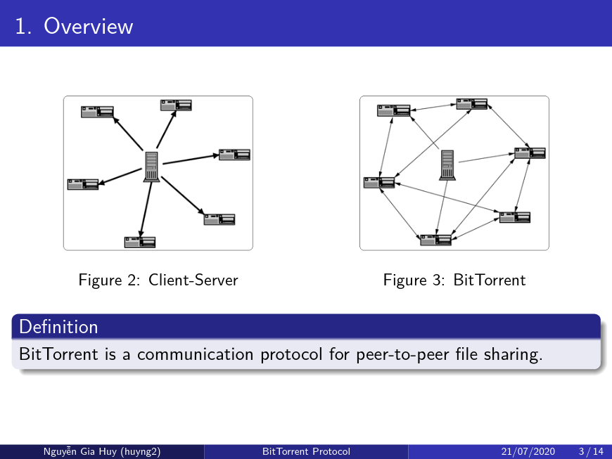

``` bash
pandoc -t beamer <input.md> <output.pdf>

```

```
---
title:
- BitTorrent Protocol
author:
- Nguyễn Gia Huy (huyng2)
date:
- 21/07/2020
theme:
- Madrid
colortheme:
- default
---

# 1. Overview
{width=170px}

 - In 2019 
   - 2.46% downstream traffic 
   - 27.58% upstream traffic

# 1. Overview
::: columns

:::: column
{width=150px}  
::::

:::: column
{width=150px}
::::

:::

## Definition
  BitTorrent is a communication protocol for peer-to-peer file sharing.

# 1. Overview

## Author
::: columns

:::: column
{width=130px}
::::

:::: column
- 2001, Cohen wrote the first BitTorrent client implementation in Python.
- 2002, Cohen collected free pornography to lure beta testers to use the program.
::::

:::

# 2. Specification
- Don't have a server
- Users (peers) download/upload from each other simultaneously
- Splits the files up into **pieces** with fixed size e.g 256KB, 1MB
- Hashes the pieces

# 2. Specification
1. User download a **.torrent** file  
or use **magnet link** e.g `magnet:?xt=urn:btih:&xl=...`.
2. Torrent client (uTorrent, Tranmission, qBittorrent..) connects to **trackers** or 
**distributed hash table (DHT)** to find more peers
3. Start **torrenting**

{width=200px}

# 2. Specification
- Piece Selection Algorithm
  - Random first piece first
  - Then rarest first, rarest piece in the swarn 
  - Strict policy
  - End game mode

\begin{center}
\includegraphics[height=3cm]{endgame.jpg}
\end{center}


# 2. Specification
- Upload to who? tic-for-tat algorithm
- Choking algorithm

\begin{center}
\includegraphics[height=3cm]{co-noco.png}
\end{center}

# 3. Advantages & Disavantages
## Advantages
- Less load traffic on a server
- Efficient for transer large file
- Higher participant = more optimal performance

# 3. Advantages & Disavantages
## Disavantages
- File can not be revised
- Illegal material
- List of IPs and the files they are downloading can be obtained from trackers

# 4. Usecase
- Multimedia distribution
  - Both legal and illegally
  - Public broadcast
- Software distribution
  - Blizza game
  - Windows update
  - Opensource project
- Educational and acadamic communities
  - Academic paper, dataset, research

# 5. Legal implications
Torrenting itself is not illgal. The sharing of copyrighted material is illegal

# 6. Refererences
> https://skerritt.blog/bit-torrent/  
> https://en.wikipedia.org/wiki/BitTorrent
> http://www.bittorrent.org/beps/bep_0005.html
> https://www.reddit.com/r/torrents/
> http://www.bittorrent.org/beps/bep_0000.html
> https://torrentfreak.com/

# 7. Question
\begin{center}
\includegraphics[height=7cm]{q.png}
\end{center}
```

# Some generated slide





